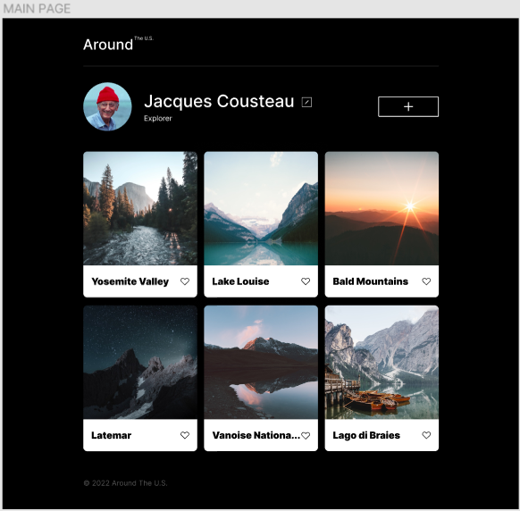
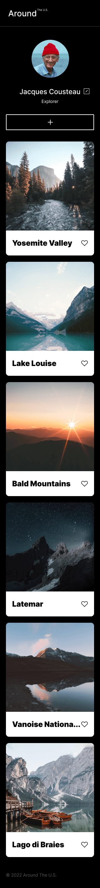

# Project 3: Around The U.S.

### Overview

- Intro
- Figma
- Images

**Intro**

Welcome to Project 3: Around the U.S.
As you will read along, this project will show you a series of stages that follow and evolve my understanding of coding concepts through each stage's process. It will start will basic concepts and gradually build upon one another to create this site. I will break up the processes into the following phases where each functional concept was developed!

**phase I**

This project is made so all the elements are displayed correctly on popular screen sizes.

The skills displayed in this project is to excercise the understanding and distinction between adaptive and responsive web design, Figma as well as useful functions such as grid layout, @fontface and media queries.

**phase II**

**Figma**

- [Link to the project on Github]
  (https://luckygith.github.io/se_project_aroundtheus/)

**Images**

The project's name.
A description of the project. Write about its features and functionality, why you made it, and what problem it addresses. If you practiced using a new framework or made any animations with it, include that information. You can also specify the stack here if you used many technologies at once.
Pictures, gifs, or screenshots that detail the project features.
Link to a project page if it's working.
A demo video of the project (optional).
An instruction on deployment and system requirements (what versions of which languages, and plugins are essential for it to work), so one could use the code and make sure it actually works.
Plans to improve the project, if you have any. Not just "Refactor code," but "Fix X using Y to achieve Z." The more detail, the better.
Some other things you can add: extensive project documentation, setting up CLI to run the project, and for larger projects, a list of people who worked on it.
