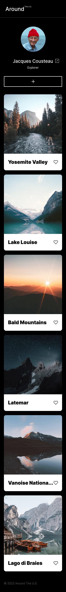

# Project 3: Around The U.S.

### Overview

- Intro
- Figma
- Images

**Intro**

Welcome to Project 3: Around the U.S.
As you will read along, this project will show you a series of stages that follow and evolve my understanding of coding concepts through each stage's process. It will start will basic concepts and gradually build upon one another to create this site. I will break up the processes into the following phases where each functional concept was developed!

**phase I**

This project is made so all the elements are displayed correctly on popular screen sizes.

The skills displayed in this project is to excercise the understanding and distinction between adaptive and responsive web design, Figma as well as useful functions such as grid layout, @fontface and media queries.

**phase II**

**Figma**

In learning the basics of working with designers and possible future prospects in the field, it is important to learn how to be able to translate a design into code. This phase furthered my understanding of the importance of being detail oriented and where the responsibilities of the sofware engineer lie in understanding and communicating amongst possible peers in the future.

**phase II**

**Javascript**

Learning Javascript in a series of functions and learning to condense and refactor functions was a challenging yet exhilarating part of this phase. A lot of experimenting, exploring and excercise with multiple variables and functions were done on my own time o be able to understand this. I learned a lo of useful and common functions that are used in todays everyday code and although what was asked of this project was achieved, a lot of improvement in refactoring the events of this code can still be possible and will be worked on.

- [Link to the project on Github]
  (https://luckygith.github.io/se_project_aroundtheus/)

**Images**

This project is exemplify an understanding of basic concepts that underwent and will undergo a series of improvements based on the ongoing level of skills learned throughout the journey of evolving my skills in HTML, CSS and Javascript!
