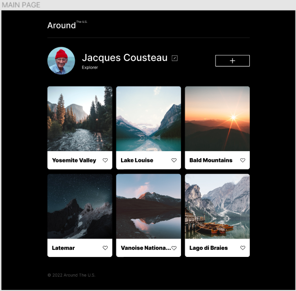
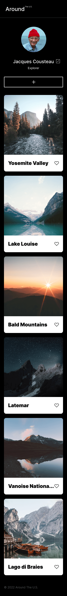

# Project 3: Around The U.S.

### Overview

- Intro
- Figma
- Images

**Intro**

Welcome to Project 3: Around the U.S.
As you will read along, this project will show you a series of stages that follow and evolve my understanding of coding concepts through each stage's process. It will start will basic concepts and gradually build upon one another to create this site. I will break up the processes into the following phases where each functional concept was developed!

**Sprint 1**

This project is made so all the elements are displayed correctly on popular screen sizes.

The skills displayed in this project is to excercise the understanding and distinction between adaptive and responsive web design, Figma as well as useful functions such as grid layout, @fontface and media queries.

**Images**

This project is exemplify an understanding of basic concepts that underwent and will undergo a series of improvements based on the ongoing
level of skills learned throughout the journey of evolving my skills in HTML, CSS and Javascript!

**Sprint 2**
Cross-browser compatibility
Adding fonts to a webpage
Adding video, sound, and page embeds
An introduction to APIs with YouTube
CSS animations and transformations
Creating and styling forms
BEM: file organization
Advanced Git and more command line
Soft skills: how to grow from your mistakes

**Sprint 3**

Work with designs in a graphics editor called Figma
Create responsive websites using Grid Layout
Use media queries to set parameters for different screen sizes
Work with branches in Git

Intro to Figma

Figma

In learning the basics of working with designers and possible future prospects in the field, it is important to learn how to be able to translate a design into code. This phase furthered my understanding of the importance of being detail oriented and where the responsibilities of the sofware engineer lie in understanding and communicating amongst possible peers in the future.

**Sprint 4**

Javascript
HTML and CSS thorugh Javascript
debugging

Create your own array of data
Add markup code for the modal window
Access and toggle the modal window
Add more functionality to the project with JavaScript

Learning Javascript in a series of functions and learning to condense and refactor functions was a challenging yet exhilarating part of this phase. A lot of experimenting, exploring and excercise with multiple variables and functions were done on my own time o be able to understand this. I learned a lo of useful and common functions that are used in todays everyday code and although what was asked of this project was achieved, a lot of improvement in refactoring the events of this code can still be possible and will be worked on.

- [Link to the project on Github]
  (https://luckygith.github.io/se_project_aroundtheus/)

**Sprint 5**
data types
conditions
loops
arrays
functions

Formulating and working with code organized into arrays and loops that will allow the content on interface page to have efficient interactivity with page elements via Javascript through functions like add, remove and replace.

**Sprint 6**
Objects
Event handling
Working with forms
Form validation

Forming code structure that interacts with the HTML and interactive interface.

**Sprint 7**
OOP - Object-oriented programming

Learning difference forms of organizing information through object-oriented programming such as: Classes, Encapsulation, Inheritance, and Polymorphism.

In this sprint, I excercised organizing my javascript code into sections like blocks, and classes - which in turned allowed me to make a more reusable and sustainable code that can help in the longevity of evolving with it over time as new information or structuring may and can arise. 

**Sprint 8**
Object and Array Destructuring

Learning how to organize information into a tangible and useful syntax that allows me to create a usable source between recieving and sending information. 

Destructuring allows

**Sprint 9**
API and API refactoring
Node Javascript
Asynchronous Javascript

